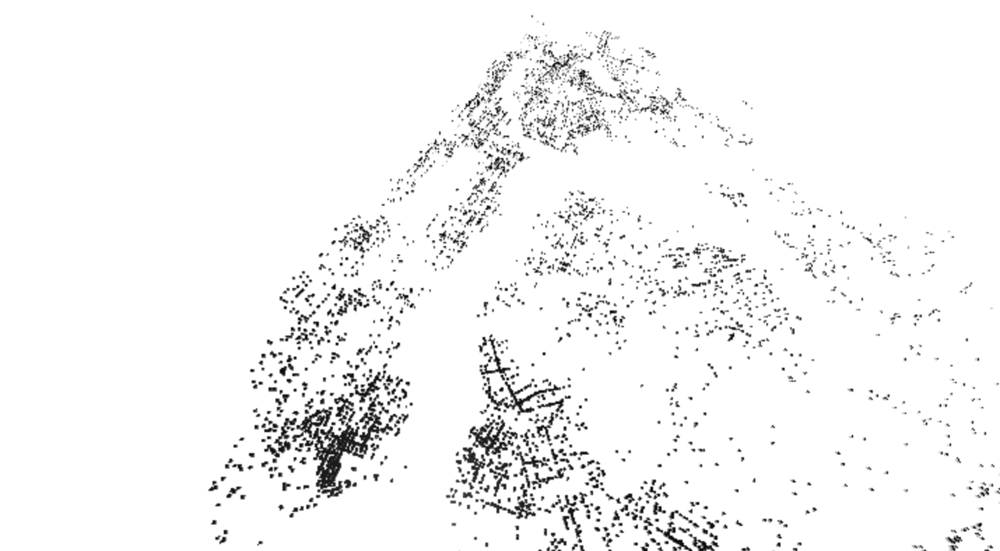
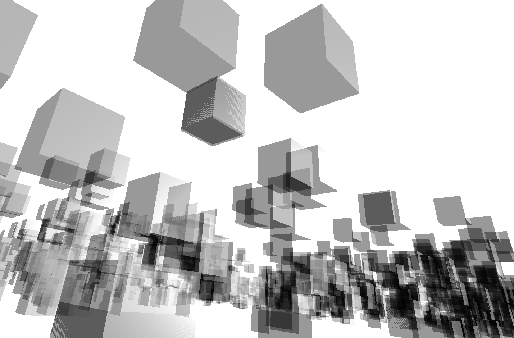
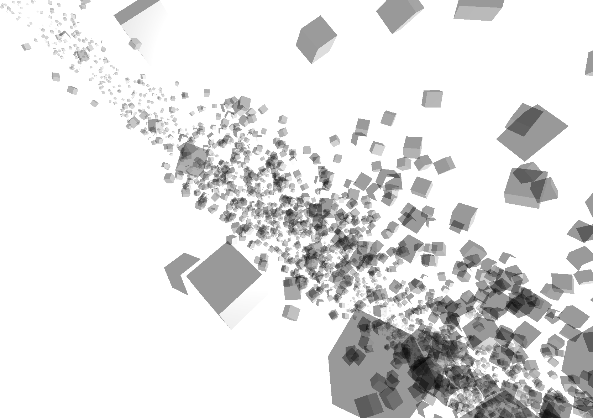
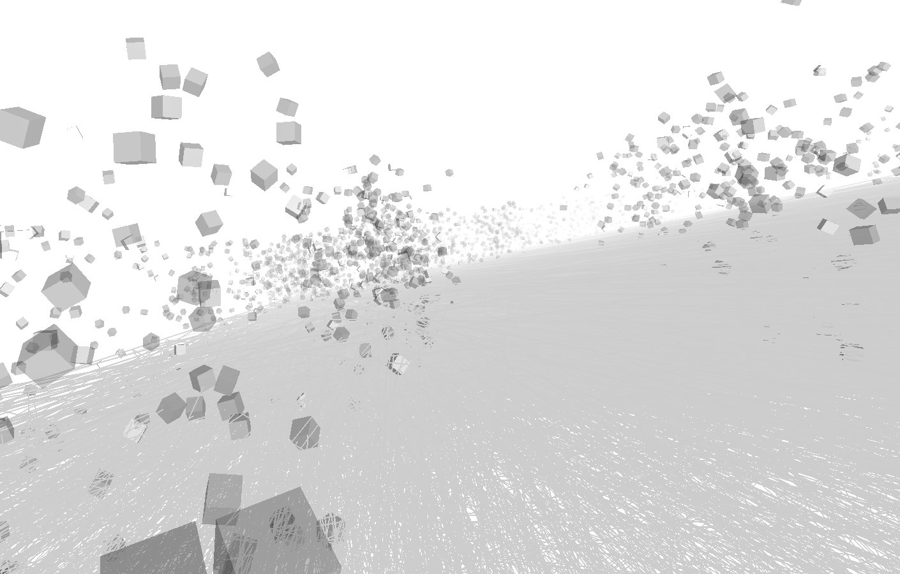

# graffiti-data
*by Jessica Herzog & Michael Braverman*

A data visualization based on [DSNY Graffiti Reports]( https://data.cityofnewyork.us/City-Government/DSNY-Graffiti-Information/gpwd-npar) from [ NYC OpenData](https://data.cityofnewyork.us/).

Uses [three.js](https://threejs.org/) for 3d visualization.

## [0x01](https://jessherzog.github.io/graffiti-data/01/index.html)

## [0x02](https://jessherzog.github.io/graffiti-data/02/index.html) - Glitch Outcomes

## [0x03](https://jessherzog.github.io/graffiti-data/03/index.html) - n+1 Dimension

## [0x04](https://jessherzog.github.io/graffiti-data/04/index.html) - Data Cocoon

## [0x05](https://jessherzog.github.io/graffiti-data/05/index.html) - I know your Data Device
<!--  -->
